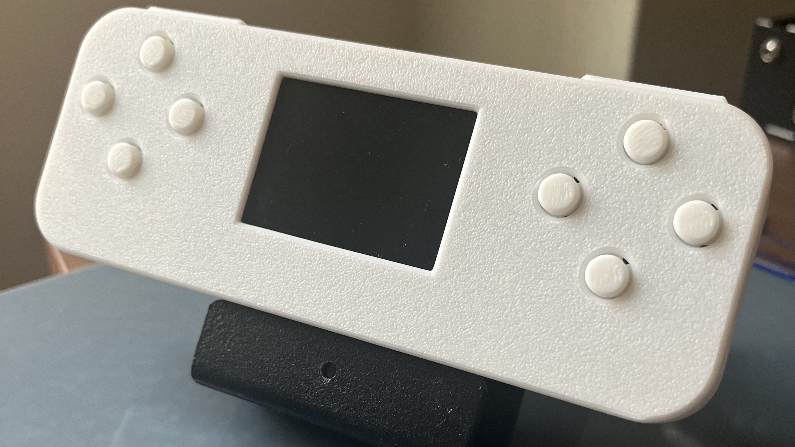
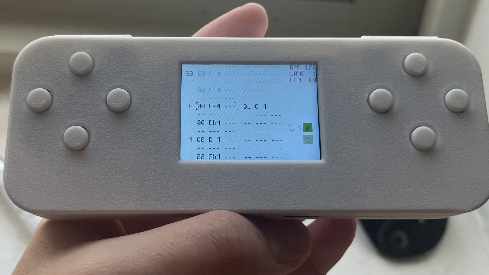

# MiniTracker

a sample-based handheld hardware tracker built with the Daisy Seed inspired by Renoise, the Polyend Tracker, and the Dirtywave M8.

## Video Demo

## Installation

Follow [this guide](https://daisy.audio/tutorials/cpp-dev-env/#3-vs-code) to intall the Daisy toolchain on your system / in your IDE of choice.

Flash the [bootloader to the Seed](https://daisy.audio/tutorials/_a7_Getting-Started-Daisy-Bootloader/), build the project, then flash to SRAM with `make program-dfu`.

You may need to change some code so that your pin setup is correct if changing any hardware. Pin setup can be found in `UserDefines.h`

To change the theme colors of the MiniTracker, change the color Macros located at `src/UI/util/colors.h`

## UI

### Controls

There are 11 buttons on the MiniTracker: 1 power button, 2 bumpers, and 8 general controls. The layout is similar to that of a game controller with the left 4 buttons being used for moving around the screen and the right 4 buttons for interacting. The bumpers allow you to switch between screens. 

#### Button arrangement

*Left Side*
 - left button is **left**
 - right button is **right**
 - top button is **up**
 - bottom button is **down**

*Right Side*
 - bottom button is **A**
 - right button is **B**
 - top button is **play**
 - left button is **shift**

#### Screens

There are 5 main screens on the MiniTracker: The sequencer, the sample editor, the fx editor, the sample loader, and settings. 

### Sequencer screen

#### Edit Mode

To enter edit mode, press the A button. This transforms the 4 left button controls to edit the step contents. Holding shift and using the 4 left buttons allows you to move between steps while remaining in edit mode. 

To delete a step, press the B button.

To exit edit mode, press A button again.

Steps are organized in 3 main chunks: instrument, note, and fx: 

`00 C#1 R08` 

 - the first chunk is the instrument ID being played. The instrument ID number will be displayed in both the sample loading and sample editing screens
 - the second chunk is the note being triggered
 - the third chunk is the step fx. The letter determines which effect is chosen and the number (in hexadecimal) represents the effect amount. 

#### Song Mode

In song mode, the left 4 buttons can move the cursor around the screen. 

To hear the current pattern on loop, press the play button. To play through all pattern in order, hold shift and press play. 

To edit a different pattern or change the pattern order, hold shift and use the left 4 buttons. Up and down moves sequentially to the previous or next pattern in the arrangement. Left and right selects which pattern is at that point in the arrangement. 

### Sample Editor

On this screen you can edit how your samples will be played back including pitch shifting, slicing, and envelope modifications. Looping will be added in an update at some point. 

To move between instruments, hold shift and use the up or down buttons

#### Slice Mode

The MiniTracker operates primarily on sample slicing to sequence samples. 

To enter *Slice Mode*, hold shift and press play. 

You are in *Slice Mode* if the sample waveform has a transparent selector on it. 

To add a slice press A. New slices are automatically placed halfway between the current slice and the next slice. To delete a slice press B. 

To move to the previous or next slice use the left and right buttons.

To move the slice position forward or backward use the up and down buttons. 

To hear the current slice, press the play button. 

#### Parameter Mode

Sample playback is altered by 3 main parameters: pitch, gain, and ADSR. 

To enter *Parameter Mode*, hold shift and press play

You are in parameter mode if the text at the bottom of the screen is highlighted. 

To change the value of the highlighted parameted, use the up and down buttons

To move between parameters, use the left and right buttons.

### FX Editor

Each of the 4 lanes in the sequencer is processed through its respective effects before being sent out the master. 

To move between effects, hold shift and use the left and right buttons. 

To move between lanes, hold shift and use the up and down buttons. 

To add an effect to the selected FX slot, press A. This will open a drop down menu where an effect can be selected by pressing A or the menu can be closed by pressing B

To delete an effect, press A to open that menu and select the `---` option in the drop down. 

To move between parameters, use the left and right buttons. 

To change the value of the selected parameter, use the up and down buttons

### Sample Loading

The MiniTracker operates by loading samples from an MicroSD Card onto its SDRAM. This screen is used for loading those samples into memory. 

The SD Card must be formatted in Fat32 and contain 1 folder named `Samples` and 1 folder named `Projects`

Samples must be wave files. There will eventually be support for 32 bit float wave files. 

To move through the open directory, use the up and down buttons. The screens do scroll, although there is no scroll bar yet. 

To open a folder press the A button.

To exit a folder, press the B button.

To load a sample, press the A button.

To delete a sample, select a sample by holding shift and using the up and down buttons, and the hold shift and press B. 

### Settings

The settings screen is where you can save or load projects, change the output volume, or change the project BPM. 

To move the cursor, use the left and right buttons. 

To select and option, press A.

If `Save` is selected, it will save the current open project to the `Projects` folder.

If `Save As` is selected, it will open a keyboard where you can name the project before saving it to the `Projects` folder

If `Load` is selected, it will open the `Projects` folder where you can select which project to open. 

If volume is selected, use the up and down buttons to change the value.

If BPM is selected, use the up and down buttons to change the value.

## Solved Problems

There were many novel problems that I had to solve, chief among them were: sample playback, file directory / FatFS, and UI design. 

### Sample Playback

Sample playback on the Daisy is tough because there is no built in capability. The built in library plays samples straight from an SD Card with no interpolation where as I needed to play samples from SDRAM with interpolation. I used the built-in Hermite interpolation algorithm which allowed for play back of samples at any sample rate. To get around different bitrate, I convert all samples to float values at load time. 

Actually sample playback is achieved through a sample struct which holds a pointer to the start address of the sample in SDRAM and the number of values associated with the sample. From there, I interpolate by using a double precision float between 0 and 1 to determine position and use Hermite interpolation to get the next sample. This essentailly allows me to treat the sample as continuous allowing very solid sounding pitch shifting and flexibility when it comes to sample rates. 

### File Directory

I ran into a bunch of headaches trying to implement file directory searching through the UI. The solution I came up with frontloads all the searching and reconstructs file paths at run time. 

Basically, I use a recursive DFS algorithm to store all the directories and files into a tree. I do this by keeping track of the file / folder name, sub directories and files as well as the parent directory. When you look through the file directory as a user, you are actually just searching through the tree. 

When it come time to load a file, I back track through the tree with the parent nodes to reconstruct the search path based on the names of the files. 

This has worked flawlessly so far. 

When it comes to adding files when using `Save As`, I simply parallely create a node where the file would be and use the same recursive approach to load that file. 

There were also a lot of hardware issues I was having prior to putting everything on a PCB. Important thing to note: use 47k pull ups like it says in the Daisy Seed documentation, they are important so you don't cook your SD Card. 

### UI Design

I made the dumb choice of not using a preexisting UI library as I didn't want to port the display options onto the DadGFX ST7789 SPI Drivers. So I designed everything myself. 

This is still somewhat an issue as the I am redrawing everything every frame (like rewriting into the ST7789 RAM). It would be better to use BitMaps and only write into RAM for changes that are necessary. This is still to be done. 

I had to mess around a lot with SPI transport to try to get the most efficient RAM writes. I think ultimately, I would be better off writing to RAM on the Daisy and having the screen directly on the PCB as opposed to on a breakout but alas, it is what it is. 

## To Do

Biggest thing is running some kind of alpha test to find overlooked issues and improve user experience (optimizing controls for ease of use, implementing quality of life changes, etc). 

Next would be writing some kind of user manual as the controls are sometimes convoluted (might also just be a UX problem).

### UX / Quality of Life Changes
 - Add lane mute functionality
 - Add a performance mode
   - Mess around with an gyroscope?
 - make step edit consistent across steps

### Known Bugs / Issues
 - Noise from TFT and from SD card when loading / reading (hardware issue)
 - The position of the 5th slice disappears when loading a file
 - Incorrectly reads 32 bit float wave files
 - Potential for memory fragmentation from EventQueue and patterns
    - Implement custom allocator?
 - Get NullPointerException when trying to access non-existent lane on FX 
 - Add PCB and enclosure files to repository
 - PAM8302 Amp very noisy on output. 
 - Headphone detect not working

### Changes to Library
 - `SD_TIMEOUT` in `sd_diskio.c` changed to 1000 ticks instead of 30 * 1000 ticks 
